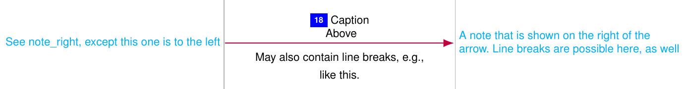

# Annex Documentation

Annex translates yaml-specifications to LaTeX tikzpictures.
The annex language is described in the following.

This documentation assumes you're familiar with YAML, LaTeX, and TikZ.

## General Remarks

Annex is designed to create protocol flow pictures, in particular for web protocols. As such, the following concepts are central to annex:

 - Parties: Protocol participants, e.g., a server and a client. Parties have a defined start and end. Between start and end, a party is represented by a lifeline.
 - Protocol Steps: Basically anything that a party does, e.g., sending a request or postMessage, executing some script, performing some check, ... Annex comes with a number of predefined protocol steps, listed below.
 - Matrix layout: The tikzpicture created by annex uses a matrix/tabular-like layout with rows and columns. Usually, each protocol step lives in its own row and each party lives in its own column.

## Options

An annex file starts with an `options` dictionary.
This dictionary may contain the following keys:

 - `enumerate`: LaTeX code to be executed to display protocol step numbers. Is used in a python format string which expects two format specifiers: An integer (unique number of the step) and a string (a tikz node name).
   - E.g., `\setcounter{protostep}{%d}\protostep{%s}` with an appropriately defined macro `\protostep` which uses the `protostep` counter and the given string to show the step number in a TikZ node and assign the given string as TikZ node name to that circle.
 - `colsep`: LaTeX distance between parties' lifelines, e.g., `0.2\textwidth`
 - `rowsep`: Like `colsep`, but for (additional) vertical distance between steps
 - `styles`: A list of style definitions, using the following elements
   - `!style-default {}`: The default style provided by annex
   - `!style-debug {}`: A debugging style provided by annex, showing some additional debug information
   - `!style-custom`: A dict containing exactly one element:
     - `style`: TikZ style definitions (usually for annex elements)
 - `tex_intro`: LaTeX code which is included in the output tex file before the tikzpicture. Intended use is the definition of TeX macros which are used in captions etc. (so these macros can be defined in the same context as their usage). You may want to use `\providecommand` instead of `\newcommand`, in case you have multiple figures with the same commands.

Full example for `options`:

```yaml
options:
  enumerate: '\setcounter{protostep}{%d}\protostep{%s} '
  colsep: 0.2\textwidth
  rowsep: 0ex
  styles:
    - !style-default {}
    #- !style-debug {}  # Remove leading "#" to enable debug output
    - !style-custom
      style: |
        annex_multistep_caption_text/.style={font=\sffamily\tiny\color{teal}},
        annex_condensed_box/.style={draw=teal,rounded corners=1ex,inner sep=1pt},
  tex_intro: |
    \providecommand{\rfc}[1]{\href{https://datatracker.ietf.org/doc/html/rfc#1}{RFC #1}}
    \providecommand{\red}[1]{\textcolor{red}{#1}}
```

With the macro `\protostep` defined as (and `\newcounter{protostep}[figure]` in the preamble):

```
\def\protostep#1{%
  \resizebox{!}{0.8\baselineskip}{%
    \begin{tikzpicture}[baseline={([yshift=-0.5pt]O.base)}]
      \node (O) [sharp corners,fill=blue,inner sep=1ex]
        {\color{white}\textbf{\refstepcounter{protostep}\theprotostep\label{protostep:#1}}};
    \end{tikzpicture}%
  }%
}
```

## Protocol

Actual protocol definition, a dict containing `parties` and `steps`, e.g.

```yaml
protocol:
  !Protocol
  parties:  # Define all protocol parties here
    - &browser  # Needed to reference party in "steps" below
      !Party
      name: Browser  # Visible name of the party
      style: ''  # TikZ style applied to party's start and end nodes
    - &server
      !Party
      name: Webserver
    - &placeholder-column
      !dummy-party  # dummy-parties "reserve" a column, e.g., for notes.
  
  groups:
    - !Group
      name: '"Real" Parties'
      parties:
        - *browser
        - *server

  steps:
     ... # See below
```

### Groups of Parties

TODO, see `examples/demo.yml` for examples.

## Protocol Steps

There are a number of predefined protocol steps build into annex, plus some special things like horizontal separators, parallel execution, etc.
On the yaml side, a protocol step is a list item, the type of protocol step is selected via yaml's local tags (e.g. `!http-request`)
Each type of protocol step has a number of (mostly optional) arguments which define captions, appearance, etc. - in the following, everything not declared as "required" is optional and everything without a shown default value has an empty default.

### Start/End Party

All non-dummy parties have to be started and ended in order to be visible.
```yaml
- !start-party
  party: *browser  # Required
- !end-party
  party: *browser  # Required
```


Parties (mostly browser tabs/instances) can also be started by immediately opening a window. See `examples/demo.yml` for examples.

### Messages

Represented as arrows between two parties' lifelines.

#### Generic Message

```yaml
- !msg
  src: *browser  # Required, except if reply_to is given
  dest: *server  # Required, except if reply_to is given
  reply_to: *some-other-msg  # Take src and dest from a step identified by anchor &some-other-msg (and reverse them for this msg)
  id: 'some-msg'  # Used as LaTeX label for this step (see definition of \protostep above)
  caption: "Caption\n Above"  # May contain line breaks as '\n' (if double quotes are used)
  caption_below: |
    May also contain line breaks, e.g.,
    like this.
  style: ''  # Additional TikZ style to apply to arrow
  skip_number: false  # Default: false. If true, do not assign a number to this step
  draw_contour: true # Default: true. Draw a white contour around all text belonging to this step
  note_right: 'A note that is shown on the right of the arrow.\\Line breaks MUST be LaTeX-\\line breaks'
  note_left: 'See note\_right, except this one is to the left'
  note_style: 'cyan' # Additional TikZ style applied to note_right/note_left
```



Note that most of the arguments to generic messages can also be applied to other message types (and are not all repeated there). The following arguments apply to all other messages, unless noted otherwise:

 - src
 - dest
 - reply_to
 - id
 - style
 - skip_number
 - draw_contour
 - note_right, note_left, and note_style

#### Out-of-Scope Message

Like generic message, but with a dashed arrow.

```yaml
- !out-of-scope-msg
  src: *browser
  dest: *server
  caption: "Some message (out of scope)"
  caption_below: ''
```


#### HTTP Request

Like generic message, but takes `method`, `url`, and `parameters` instead of `caption` and `caption_below`.

```yaml
- !http-request
  src: *browser
  dest: *server
  method: POST
  url: https://example.com
  parameters: state=good
```

#### HTTP Response

Like generic message, but takes `code`, `headers`, and `parameters` instead of `caption` and `caption_below`.
If neither code, nor headers are given, "Response" is used as caption above the arrow.
The arrow heads of responses' arrows are empty (as opposed to the filled arrow heads in requests).

```yaml
- !http-response
  src: *server
  dest: *browser
  code: "200"
  headers: "Set-Cookie: c=ake; Secure"
  parameters: '\{\}'
```


#### PostMessage

```yaml
- !postmessage
   src: *server
   dest: *browser
   body: "stuff"
   comment: "Example for a comment"
```


#### Other Messages

 - `!xhr-request`: Like HTTP Request, but uses a different drawing style
 - `!xhr-response`: Like HTTP Response, but uses a different drawing style
 - `!websocket`: Like HTTP Request, but uses a different drawing style and `method` and `url` are ignored (caption over the arrow is "WebSocket")
 - `!http-request-response`: A compact request/response pair. Takes the same arguments as HTTP Request.
 - `!xhr-request-response`: As `!http-request-response`, but uses a different drawing style
 - `!http-response-request`: As `!http-request-response`, but with response first
 - `!xhr-request-response`: As `!xhr-request-response`, but with response first


### Actions

#### Generic Action

```yaml
- !action
  party: *browser  # Required
  id: 'some-action'
  label: 'Browser does stuff'  # Required
  skip_number: false
  draw_contour: true
  style: ''
  note_left: ''
  note_right: ''
  note_style: ''
```


#### Script Action

```yaml
- !script-action
  src: *browser  # Required
  dest: *server  # Required
  id: 'some-script-action'
  data: 'Data'
  label: 'Browser does stuff'
  skip_number: false
  draw_contour: true
  style: ''
  note_left: ''
  note_right: ''
  note_style: ''
```


### Special Protocol Steps

#### Parallel & Serial

Note: A box around parallel or serial steps is drawn if `condense` or a `label` are used (i.e., are not false/empty).

```yaml
- !Parallel
  condense: false # If true or a TikZ node anchor (like 'north west'):
                  # Whole block gets a number (drawn at specified node anchor,
                  # default 'north west'), steps in block do not get a number.
  id: 'some-parallel-things'  # Particularly useful with condense
  label: 'Description of parallel things'
  label_pos: 'north east'
  steps:
    - ... # Any protocol steps (including other !Parallel or !Serial)
```

Use of `!Parallel` is recommended to start/end multiple parties at once.

```yaml
- !Serial
  # condense etc. like in !Parallel
  steps:
    - ... # like in !Parallel
```

#### Vertical Space

Sometimes, you need to manually add some vertical spacing, e.g., to make room for a label on a `!Serial`. In this example, the spacing can be achieved by adding a `!VerticalSpace` as the first step of the `!Serial`.

```yaml
- !VerticalSpace
  party: *browser  # Required
  valign: 'south' # Vertical alignment of the spacing. Use debug style to see effects
                  # on matrix row height - 'south' is small, 'center' is bigger.
  amount: '0ex'  # Amount of space - as the vertical space is a "real" protocol step
                 # and takes up a matrix row, we often don't need any additional space
```

#### Comment

Comment over full width of picture (centered).
```yaml
- !comment
  label: 'A long comment, spanning multiple columns'  # Required
  text_style: 'red,font={\bfseries}'
  draw_contour: true
```

